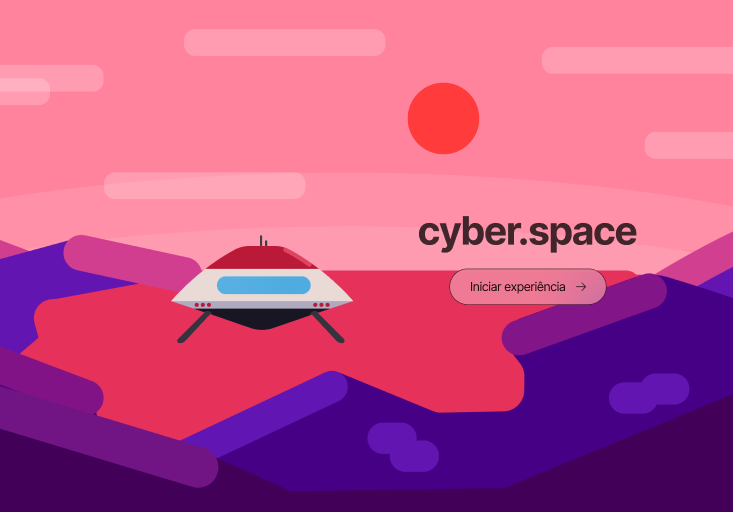
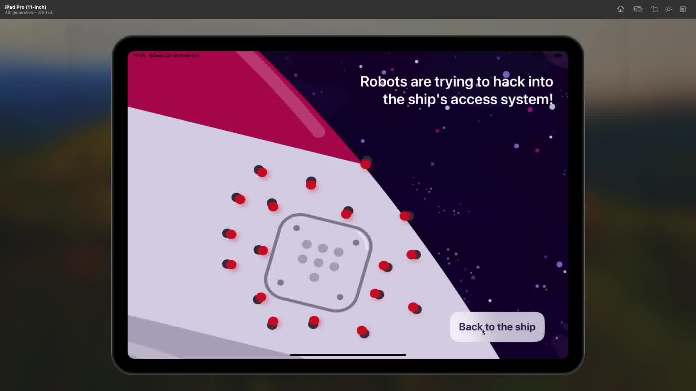
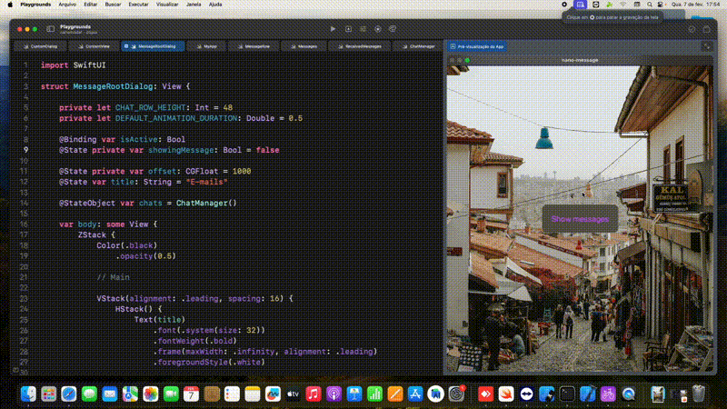

# cyber.space - Winner of the Swift Student Challenge 🚀

**cyber.space** is an educational and interactive game developed to raise awareness about the importance of **cybersecurity**. In it, players take on the role of Michael, an intergalactic traveler who must protect his ship from digital threats while traveling to the planet Aqualis. During this journey, players face challenges based on real attacks, such as **nanorobot invasions** and **phishing attempts**, while learning good security practices like using **strong passwords** and **identifying fraudulent emails**.

> **Award**: cyber.space was one of the winners of the **Swift Student Challenge**, an international competition hosted by **Apple**. 🎉

  

*Initial interface of cyber.space, with the title and start button.*

## Objectives

- **Educational Gameplay**: Teaches cybersecurity concepts through interactive challenges.

- **Real-World Attack Scenarios**: Face nanorobot invasions, phishing attempts, and more.

- **Digital Awareness**: Learn how to create strong passwords and spot online fraud.

- **Exclusive Aesthetics**: All graphic elements were hand-crafted to provide a unique experience.

## 🌌 The Creative Process

The development of **cyber.space** was inspired by the connection between the online world and the vast unpredictability of space. The game creation process involved:

1. Choosing the space theme to represent digital challenges (*a theme I really enjoy*).
2. Manually creating all the graphic elements.
3. Detailed planning to ensure an immersive and educational experience.

  

*Scene where nanorobots attack the ship.*

## 🚀 Development Challenges

- A significant challenge was finding ways to teach players how to identify phishing attacks, requiring in-depth research and constant testing to ensure it didn’t become boring.

- The project was developed using a MacMini remotely accessed from the Federal Institute of Ceará, which caused delays when the equipment became unavailable.



*Testing the message system prototype.*

## 🏆 Recognition

**cyber.space** was recognized as one of the winners of the **Swift Student Challenge** hosted by Apple. The project highlights the importance of educating people about cybersecurity in an interactive way.

## 🛠️ Technologies Used

- **Swift**: Main programming language.
- **SwiftUI**: Primary framework.
- **Xcode**: Integrated development environment (IDE).
- **Illustrator, Photoshop, and Figma**: For creating manual graphics.

## 📦 Installation and Execution

To run **cyber.space**, follow the steps below:

```bash
# Clone the repository
git clone https://github.com/yourusername/cyberspace.git

# Open the project in Xcode
cd cyberspace
open cyberspace.xcodeproj

# Compile and run on a simulator or a physical device
```

## ⚠️ Disclaimer

Due to the tight deadline for the **Swift Student Challenge**, the quality of the **cyber.space** code may not fully reflect my technical abilities. This project was developed within a limited timeframe, and with more time for planning and refinement, I could have further improved the implementation and optimized the code.

## 📝 License

This project is licensed under the terms of the [MIT License](./LICENSE).
